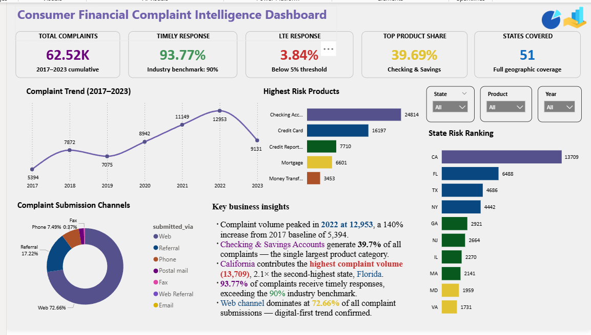

# Consumer Complaint Intelligence & Risk Analytics Platform


[](https://app.mavenanalytics.io/datasets?search=finan)
[](https://app.powerbi.com/groups/me/reports/d8338132-ed69-4cdf-8f4d-465d75ab7989/c0ffc13bdca1d94090b4?experience=power-bi)

> **End-to-end data analytics project** — from raw complaint data to executive dashboard — analyzing 62,516 consumer financial complaints (2017–2023) to surface product risk, geographic hotspots, and operational gaps.

---

## Table of Contents

- [Business Problem](#-business-problem)
- [Impact](#-impact)
- [Solution Architecture](#-solution-architecture)
- [Key Findings](#-key-findings)
- [Recommendations](#-recommendations)
- [Tech Stack](#-tech-stack)
- [Project Structure](#-project-structure)
- [How to Run](#-how-to-run)
- [Dashboard Preview](#-dashboard-preview)
- [Skills Demonstrated](#-skills-demonstrated)

---

## 🔴 Business Problem

**Situation:** Financial institutions process thousands of consumer complaints monthly across multiple products, states, and channels — but without structured analytics, these signals remain invisible to decision-makers.

**Problem:** The absence of a centralized complaint intelligence system meant:
- Customer pain points were buried in unstructured records
- High-risk products could not be identified early
- Response performance had no measurable baseline
- Geographic risk concentration was unknown

**Question this project answers:**
> *Which products, issues, and regions pose the highest risk — and is the organization responding effectively?*

---

## 📊 Impact

| Metric | Value |
|--------|-------|
| Total complaints analyzed | **62,516** |
| Timely response rate identified | **93.77%** |
| Late response rate flagged | **3.84%** |
| Product categories risk-ranked | **9** |
| States mapped | **51** |
| Issue categories classified | **76** |

**Business Value Delivered:**
- Identified that **2 product categories drive 66% of all complaints** → enables focused resource allocation
- Flagged **California as 2.1× higher risk** than the next state → supports regional monitoring strategy
- Revealed **Q2–Q3 as peak complaint periods** → informs staffing and SLA planning
- Quantified **fraud as 56% of Money Transfer complaints** → triggers fraud detection investment

---

## 🏗️ Solution Architecture

```
Raw Data (CSV)
    │
    ▼
[Excel] Data Cleaning & Validation
    │  • Removed duplicates, standardized nulls
    │  • Engineered: complaint_month, complaint_year,
    │    complaint_quarter, resolution_days
    ▼
[Python + Pandas] Data Wrangling
    │  • Dtype normalization, date parsing
    │  • Outlier flagging
    ▼
[PostgreSQL] Analytical SQL Layer
    │  • 5 query modules: validation → business analysis
    │    → KPIs → advanced window functions
    │  • DENSE_RANK(), window aggregates, CTEs
    ▼
[Power BI] Executive Dashboard
       • KPI scorecards, trend lines, risk ranking
       • State heat map, channel donut, filter slicers
```

---

## 🔍 Key Findings

### Product Risk
| Rank | Product | Complaints | Share |
|------|---------|-----------|-------|
| 1 | Checking & Savings Account | 24,814 | 39.69% |
| 2 | Credit Card / Prepaid Card | 16,197 | 25.91% |
| 3 | Credit Reporting Services | 7,710 | 12.33% |
| 4 | Mortgage | 6,601 | 10.56% |
| 5 | Money Transfer Services | 3,453 | 5.52% |

> Top 2 products account for **65.6% of all complaints.**

### Top Customer Issues
| Issue | Complaints |
|-------|-----------|
| Managing an Account | 15,109 |
| Purchase Statement Problems | 4,415 |
| Incorrect Credit Information | 4,145 |
| Trouble During Payment Process | 2,827 |
| Fraud or Scam | 1,951 |

### Geographic Risk
| State | Complaints | Risk Level |
|-------|-----------|------------|
| California | 13,709 | 🔴 Critical |
| Florida | 6,488 | 🟠 High |
| Texas | 4,686 | 🟠 High |
| New York | 4,442 | 🟡 Elevated |

### Complaint Trend
```
2017 ▓▓▓▓▓░░░░░░░░░░░░░░░  5,394
2018 ▓▓▓▓▓▓▓▓░░░░░░░░░░░░  7,872
2019 ▓▓▓▓▓▓▓░░░░░░░░░░░░░  7,075
2020 ▓▓▓▓▓▓▓▓▓░░░░░░░░░░░  8,942
2021 ▓▓▓▓▓▓▓▓▓▓▓░░░░░░░░░ 11,149
2022 ▓▓▓▓▓▓▓▓▓▓▓▓▓░░░░░░░ 12,953  ← Peak
2023 ▓▓▓▓▓▓▓▓▓░░░░░░░░░░░  9,131  ← Declining
```

---

## ✅ Recommendations

### 1. Product Experience
- **Immediate:** Audit account management workflows — 60%+ of checking complaints stem from account open/close/manage friction
- **Short-term:** Redesign credit card onboarding — 1,867 "Getting a Credit Card" complaints indicate acquisition funnel issues

### 2. Fraud & Risk
- **Immediate:** Deploy enhanced transaction monitoring for Money Transfer products — fraud accounts for >50% of category complaints
- **Ongoing:** Improve credit reporting dispute SLA — 4,145 incorrect information complaints signal data integrity gaps

### 3. Operations
- **Quarterly planning:** Staff up Q2 and Q3 — these quarters carry ~53% of annual complaint load
- **SLA monitoring:** The 3.84% late response rate, while below the 5% threshold, should be tracked at product level

### 4. Geographic
- **Regional dashboards:** Build state-level monitoring for CA, FL, TX, NY — these 4 states represent ~47% of all complaints

---

## 🛠️ Tech Stack

| Layer | Tool | Purpose |
|-------|------|---------|
| Data Cleaning | Excel + Python (Pandas) | Deduplication, standardization, feature engineering |
| Database | PostgreSQL 15 | Structured query layer, KPI computation |
| Analysis | SQL (Window Functions, CTEs) | Product ranking, trend analysis, response metrics |
| Visualization | Power BI | Executive dashboard, interactive filters |
| Documentation | Markdown | Project charter, KPI definitions, data inventory |

---

## 📁 Project Structure

```
Consumer-Complaint-Intelligence-Risk-Analytics-Platform/
│
├── data/
│   ├── Consumer_Complaints.xlsx      # Raw source dataset
│   └── cleaned_consumer_complaints.xls  # Post-cleaning output
│
├── notebooks/
│   └── Data_Cleaning.ipynb           # Python cleaning pipeline
│
├── sql/
│   ├── 01_create_table.sql           # Schema definition
│   ├── 02_data_validation.sql        # Quality checks
│   ├── 03_business_analysis.sql      # Core business queries
│   ├── 04_kpi_queries.sql            # KPI computation
│   └── 05_advanced_analysis.sql      # Window functions, rankings
│
├── dashboard/
│   ├── Dashboard.pbix                # Power BI source file
│   ├── Dashboard.pbit                # Power BI template
│   └── Dashbord.png                  # Dashboard screenshot
│
├── reports/
│   ├── SQL_Insights_Report.md        # Full written analysis
│   └── Consumer_Complaint_Intelligence_Platform.pdf
│
├── docs/
│   ├── Project_Charter.md            # Business context & stakeholders
│   ├── KPI_Definitions.md            # Metric definitions & formulas
│   ├── Data_Inventory.md             # Column-level data dictionary
│   └── Business_Questions.md         # Analytics question framework
│
├── LICENSE
└── README.md
```

---

## ▶️ How to Run

### 1. Clone the repository
```bash
git clone https://github.com/seema-kri/Consumer-Complaint-Intelligence-Risk-Analytics-Platform.git
cd Consumer-Complaint-Intelligence-Risk-Analytics-Platform
```

### 2. Set up PostgreSQL
```sql
-- Create database
CREATE DATABASE complaint_analytics;

-- Run schema
\i sql/01_create_table.sql

-- Load data (update path)
COPY complaints FROM '/path/to/complaints_raw.csv' CSV HEADER;
```

### 3. Run analysis
```bash
psql -d complaint_analytics -f sql/02_data_validation.sql
psql -d complaint_analytics -f sql/03_business_analysis.sql
psql -d complaint_analytics -f sql/04_kpi_queries.sql
psql -d complaint_analytics -f sql/05_advanced_analysis.sql
```

### 4. Python cleaning notebook
```bash
pip install pandas numpy jupyter
jupyter notebook notebooks/Data_Cleaning.ipynb
```

---

## 📸 Dashboard Preview

> 🔴 **[View Live Interactive Dashboard →](https://app.powerbi.com/groups/me/reports/d8338132-ed69-4cdf-8f4d-465d75ab7989/c0ffc13bdca1d94090b4?experience=power-bi)**

Power BI dashboard featuring KPI scorecards, complaint trend line (2017–2023), product risk bar charts, state risk ranking, submission channel donut, and interactive State / Product / Year filters.



---

## 🧠 Skills Demonstrated

| Skill | Applied How |
|-------|-------------|
| **SQL** | 5-file query suite: DDL, DML, window functions (`DENSE_RANK`, `SUM OVER`), aggregations, CTEs |
| **Python / Pandas** | Data cleaning pipeline — null handling, dtype casting, feature engineering |
| **Data Modeling** | Flat table schema with engineered time dimensions (month, year, quarter) |
| **KPI Design** | Defined and computed 9 business KPIs with clear formulas and benchmarks |
| **Data Storytelling** | Structured findings using Problem → Finding → Business Impact → Recommendation |
| **Dashboard Design** | Executive Power BI layout with filter slicers, ranked visuals, trend analysis |
| **Business Acumen** | Translated complaint data into product risk scores, geographic alerts, and staffing recommendations |
| **Documentation** | Project charter, data dictionary, KPI definitions, full SQL insights report |

---

## 👤 About

**[Your Name]**
Aspiring Data Analyst | SQL · Python · Power BI · Excel

- 📧 [your.email@gmail.com]
- 💼 [linkedin.com/in/yourprofile]
- 🌐 [yourportfolio.com]

*Open to data analyst internship and entry-level opportunities.*

---

[](https://app.mavenanalytics.io/datasets?search=finan)

**Dataset:** [Financial Consumer Complaints — Maven Analytics Data Playground](https://app.mavenanalytics.io/datasets?search=finan)
Consumer complaints on financial products & services (2017–2023). Sourced from the CFPB Consumer Complaint Database via Maven Analytics. Free to use for educational and portfolio purposes.
