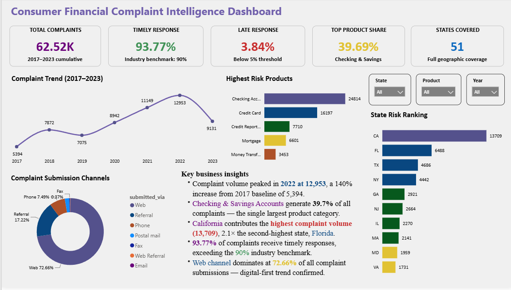

# 🏦 Consumer Complaint Intelligence & Risk Analytics
### End-to-End Risk Analytics — Data Cleaning → SQL → Executive Power BI Reporting


[](https://app.mavenanalytics.io/datasets?search=finan)
[](https://app.powerbi.com/groups/me/reports/d8338132-ed69-4cdf-8f4d-465d75ab7989/c0ffc13bdca1d94090b4?experience=power-bi)

> This project analyzes 62,516 consumer financial complaints (2017–2023) to identify product risk, regional concentration, and gaps in response performance. It's structured the way a risk/compliance analytics team would deliver it: defined business questions, a governed SQL layer, and findings written as decisions — not just charts.

---

## Decisions This Analysis Supports

Each finding below is written as a decision, with the supporting evidence and the resulting action — the format used when presenting to a risk or leadership team.

| # | Decision | Evidence Behind It | Action |
|---|---|---|---|
| 1 | **Reallocate support resourcing to 2 products** | Checking & Savings + Credit Card account for **65.6%** of all complaint volume | Shift staffing/tooling budget toward these two lines first |
| 2 | **Open a fraud-detection investment case for Money Transfer** | Fraud drives **56%** of all Money Transfer complaints | Greenlight enhanced transaction monitoring for this product line |
| 3 | **Stand up regional monitoring for 4 states** | California, Florida, Texas, New York = **~47%** of complaints; California alone sits at **2.1×** the volume of the next-highest state | Build state-level dashboards + escalation paths for these 4 |
| 4 | **Pre-staff Q2–Q3, not just year-round evenly** | Q2–Q3 carry **~53%** of annual complaint volume | Shift seasonal headcount/SLA planning ahead of peak |
| 5 | **Audit the account-management workflow now** | 60%+ of checking-account complaints trace to open/close/manage friction | Immediate UX/process audit, not a backlog item |
| 6 | **Track the 3.84% late-response rate at product level, not just overall** | Aggregate rate sits under the 5% threshold, but risk hides inside individual products | Move SLA monitoring from company-wide to per-product |

*Decisions 1, 3, and 6 require no new tooling — they're reallocation/reporting changes achievable within existing systems. Decisions 2 and 5 (fraud monitoring, workflow audit) would need a scoping conversation with Risk/Product before commitment, since they carry implementation cost beyond this analysis.*

---

## Business Problem

**Situation:** Financial institutions process thousands of consumer complaints monthly across products, states, and channels — but without structured analytics, these signals stay invisible to decision-makers.

**Problem:** Without a centralized complaint intelligence system:
- Customer pain points stay buried in unstructured records
- High-risk products can't be identified early
- Response performance has no measurable baseline
- Geographic risk concentration is unknown

**Core question this project answers:**
> *Which products, issues, and regions pose the highest risk — and is the organization responding effectively?*

---

## Impact

| Metric | Value |
|---|---|
| Total complaints analyzed | **62,516** |
| Timely response rate | **93.77%** |
| Late response rate flagged | **3.84%** |
| Product categories risk-ranked | **9** |
| States mapped | **51** |
| Issue categories classified | **76** |

---

## Solution Architecture

```
Raw Data (CSV)
    │
    ▼
[Excel] Data Cleaning & Validation
    │  • Removed duplicates, standardized nulls
    │  • Engineered: complaint_month, complaint_year,
    │    complaint_quarter, resolution_days
    ▼
[Python + Pandas] Data Wrangling
    │  • Dtype normalization, date parsing
    │  • Outlier flagging
    ▼
[PostgreSQL] Analytical SQL Layer
    │  • 5 query modules: validation → business analysis
    │    → KPIs → advanced window functions
    │  • DENSE_RANK(), window aggregates, CTEs
    ▼
[Power BI] Executive Dashboard
       • KPI scorecards, trend lines, risk ranking
       • State heat map, channel donut, filter slicers
```

---

## Key Findings

### Product Risk
| Rank | Product | Complaints | Share |
|---|---|---|---|
| 1 | Checking & Savings Account | 24,814 | 39.69% |
| 2 | Credit Card / Prepaid Card | 16,197 | 25.91% |
| 3 | Credit Reporting Services | 7,710 | 12.33% |
| 4 | Mortgage | 6,601 | 10.56% |
| 5 | Money Transfer Services | 3,453 | 5.52% |

### Top Customer Issues
| Issue | Complaints |
|---|---|
| Managing an Account | 15,109 |
| Purchase Statement Problems | 4,415 |
| Incorrect Credit Information | 4,145 |
| Trouble During Payment Process | 2,827 |
| Fraud or Scam | 1,951 |

### Geographic Risk
| State | Complaints | Risk Level |
|---|---|---|
| California | 13,709 | Critical |
| Florida | 6,488 | High |
| Texas | 4,686 | High |
| New York | 4,442 | Elevated |
| Georgia | 2,921 | Elevated |

### Complaint Trend
```
2017 ▓▓▓▓▓░░░░░░░░░░░░░░░  5,394
2018 ▓▓▓▓▓▓▓▓░░░░░░░░░░░░  7,872
2019 ▓▓▓▓▓▓▓░░░░░░░░░░░░░  7,075
2020 ▓▓▓▓▓▓▓▓▓░░░░░░░░░░░  8,942
2021 ▓▓▓▓▓▓▓▓▓▓▓░░░░░░░░░ 11,149
2022 ▓▓▓▓▓▓▓▓▓▓▓▓▓░░░░░░░ 12,953  ← Peak
2023 ▓▓▓▓▓▓▓▓▓░░░░░░░░░░░  9,131  ← Declining
```

### Complaint Submission Channels
| Channel | Share |
|---|---|
| Web | 72.66% |
| Referral | 17.22% |
| Phone | 7.49% |
| Fax | 0.37% |
| Postal Mail / Web Referral / Email | remainder (each <1%) |

**Web dominates at 72.66% of all submissions** — a clear digital-first signal. Combined with the account-management friction found above, this points to a concrete opportunity: a self-service portal fix for "manage my account" issues would reach the large majority of complainants directly, without needing phone or mail-channel workflow changes.

---

## Tech Stack

| Layer | Tool | Purpose |
|---|---|---|
| Data Cleaning | Excel + Python (Pandas) | Deduplication, standardization, feature engineering |
| Database | PostgreSQL 15 | Structured query layer, KPI computation |
| Analysis | SQL (Window Functions, CTEs) | Product ranking, trend analysis, response metrics |
| Visualization | Power BI | Executive dashboard, interactive filters |
| Documentation | Markdown | Project charter, KPI definitions, business questions |

---

## Project Structure

```
Consumer-Complaint-Intelligence-Risk-Analytics-Platform/
│
├── data/
│   ├── Consumer_Complaints.xlsx
│   └── cleaned_consumer_complaints.xls
│
├── notebooks/
│   └── Data_Cleaning.ipynb
│
├── sql/
│   ├── 01_create_table.sql
│   ├── 02_data_validation.sql
│   ├── 03_business_analysis.sql
│   ├── 04_kpi_queries.sql
│   └── 05_advanced_analysis.sql
│
├── dashboard/
│   ├── Dashboard.pbix
│   ├── Dashboard.pbit
│   └── Dashboard.png
│
├── reports/
│   ├── SQL_Insights_Report.md
│   └── Consumer_Complaint_Intelligence_Platform.pdf
│
├── docs/
│   ├── Project_Charter.md
│   ├── KPI_Definitions.md
│   ├── Data_Inventory.md
│   └── Business_Questions.md
│
├── LICENSE
└── README.md
```

---

## How to Run

### 1. Clone the repository
```bash
git clone https://github.com/seema-kri/Consumer-Complaint-Intelligence-Risk-Analytics-Platform.git
cd Consumer-Complaint-Intelligence-Risk-Analytics-Platform
```

### 2. Set up PostgreSQL
```sql
CREATE DATABASE complaint_analytics;
\i sql/01_create_table.sql
COPY complaints FROM '/path/to/complaints_raw.csv' CSV HEADER;
```

### 3. Run analysis scripts
```bash
psql -d complaint_analytics -f sql/02_data_validation.sql
psql -d complaint_analytics -f sql/03_business_analysis.sql
psql -d complaint_analytics -f sql/04_kpi_queries.sql
psql -d complaint_analytics -f sql/05_advanced_analysis.sql
```

### 4. Run the Python cleaning notebook
```bash
pip install pandas numpy jupyter
jupyter notebook notebooks/Data_Cleaning.ipynb
```

### 5. Open the Power BI dashboard
Open `dashboard/Dashboard.pbix` in Power BI Desktop, or view the **[live version](https://app.powerbi.com/groups/me/reports/d8338132-ed69-4cdf-8f4d-465d75ab7989/c0ffc13bdca1d94090b4?experience=power-bi)**.

---

## Dashboard Preview

**[→ View Live Interactive Dashboard](https://app.powerbi.com/groups/me/reports/d8338132-ed69-4cdf-8f4d-465d75ab7989/c0ffc13bdca1d94090b4?experience=power-bi)**



*KPI scorecards, complaint trend (2017–2023), product risk bars, state risk ranking, channel donut, and interactive State / Product / Year filters.*

---

## Limitations & Scope

- **Dataset:** Public CFPB complaint data via Maven Analytics — chosen for volume and structure, not a live production feed. Recommendations above assume this data behaves like an internal complaint log; a production version would need to account for reporting-channel bias (not every complaint channel is equally represented) before recommendations are finalized.
- **Time coverage:** Ends in 2023; no visibility into whether flagged issues have already been addressed since.
- **State-level risk:** Ranked by raw complaint count, not normalized by state population or customer base size — a next iteration would weight this before treating California's rank as pure risk severity.

---

## Skills Demonstrated

| Skill | Applied How |
|---|---|
| SQL | 5-file query suite: DDL, DML, window functions (`DENSE_RANK`, `SUM OVER`), aggregations, CTEs |
| Python / Pandas | Data cleaning pipeline — null handling, dtype casting, feature engineering |
| Data Modeling | Flat table schema with engineered time dimensions (month, year, quarter) |
| KPI Design | Defined and computed 9 business KPIs with clear formulas and benchmarks |
| Decision Framing | Each finding converted into a decision with supporting evidence and a recommended action |
| Dashboard Design | Executive Power BI layout with filter slicers, ranked visuals, trend analysis |
| Business Acumen | Translated complaint data into product risk scores, regional alerts, staffing calls |
| Documentation | Project charter, data dictionary, KPI definitions, full SQL insights report |

---

## About

**Seema Kumari**
Data Analyst | SQL · Python · Power BI · Excel | Turning 60K+ row datasets into risk-scored, executive-ready decisions

- 📧 kriseema87@gmail.com
- 💼 [linkedin.com/in/seema-kumari-375763308](https://www.linkedin.com/in/seema-kumari-375763308/)
- 🌐 [github.com/seema-kri](https://github.com/seema-kri)

---

**Dataset:** [Financial Consumer Complaints — Maven Analytics Data Playground](https://app.mavenanalytics.io/datasets?search=finan)
Consumer complaints on financial products & services (2017–2023). Sourced from the CFPB Consumer Complaint Database via Maven Analytics. Free to use for educational and portfolio purposes.
